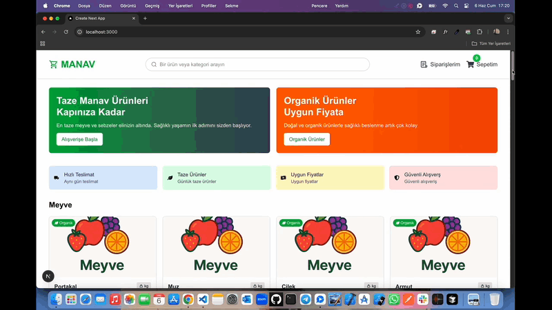

# Grocery-Ecommerce 🛒

<li>Bu proje React ve Next.js ile hazırlanmış manav market e-ticaret sitesidir.</li>
<li>Ürünler,her bir ürüne ait detay sayfası ile ekleme ve sepetten kaldırma seçeneği mevcuttur.</li>
<li>Ürünlerin stok,sepet,sipariş durumu listelenmektedir.</li>
<li>Sepetdeki ürünü satın almak için Stripe ödeme yöntemi entegre edilmiştir.</li>
<li>Kullanıcı dostu modern responsive tasarımı vardır.</li>

# Kullanılan Teknolojiler 🎨

<li>⭐ TypeScript</li>
<li>⭐ React</li>
<li>⭐ Next.js</li>
<li>⭐ MongoDB</li>
<li>⭐ React Toastify</li>
<li>⭐ Tailwindcss</li>
<li>⭐ Toastify</li>
<li>⭐ React-İcons</li>
<li>⭐ React-Dom</li>

# Ekran Görüntüsü 🎥
    

# İletişim 📩
yunusemreoral@hotmail.com.tr
